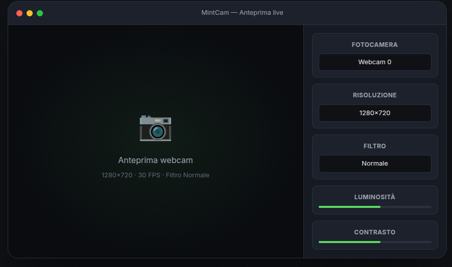

# MintCam



**MintCam** is a lightweight, feature-rich webcam application for Linux Mint. It provides a clean, dark-themed interface with live preview, photo capture, video recording, and advanced features like QR scanning, focus assist, face auto-framing, and time-lapse support.

## Screenshots


## Features

- **Live webcam preview** with real-time FPS counter
- **Photo capture** (single and burst modes)
- **Video recording** with automatic codec detection (mp4v, XVID, MJPG fallback)
- **QR/Barcode scanner** integration
- **Focus assist** with visual indicator (Laplacian variance scoring)
- **Face auto-framing** using OpenCV face detection
- **Time-lapse recording** with automatic MP4 assembly
- **Filters**: Normal, Grayscale, Sepia, Negative, High Contrast
- **Adjustments**: brightness, contrast, saturation
- **Composition grid** overlay
- **Live mirror** toggle
- **Multiple aspect formats**: 16:9, 4:3, 9:16
- **Photo timer**: 3, 5, 10 seconds
- **Photo burst**: 3, 5, 10, 15 shots
- **Preview pause**
- **Recording duration limit** (auto-stop clips)
- **Adjustable photo quality**
- **Autostart** with system
- **Dark theme UI**
- **Custom icon**

## Requirements

- **OS**: Linux Mint 21+ (Ubuntu 22.04+)
- **Python**: 3.10 or newer
- **System packages**: `v4l-utils`, `ffmpeg`, `libxcb-cursor0`
- **Python packages**: `opencv-python`, `pyzbar`, `Pillow`

## Installation

### From .deb Package

Download the latest `.deb` from [Releases](https://github.com/jeaders/MintCam/releases) and install:

```bash
sudo dpkg -i dist/mintcam_0.1.0_all.deb
```

### From Source

```bash
git clone https://github.com/jeaders/MintCam.git
cd MintCam
python3 -m venv .venv
source .venv/bin/activate
pip install -r requirements.txt
./run.sh
```

## Usage

After installation, you can:

1. Search for **MintCam** in the Linux Mint menu
2. Or run from terminal:
   ```bash
   mintcam
   ```
3. Or from the source directory:
   ```bash
   ./run.sh
   ```

### Keyboard Shortcuts

| Shortcut | Action |
|----------|--------|
| **Space** | Capture photo |
| **R** | Start/stop recording |
| **F** | Toggle focus assist |
| **G** | Toggle grid |
| **M** | Toggle mirror |
| **Q** | Toggle QR scanner |

## Output Locations

Photos and videos are saved to:

```
~/MintCam/photos/     - Captured images
~/MintCam/recordings/  - Recorded videos
~/MintCam/logs/        - Application logs
```

## Verify Webcam

To verify your webcam is detected:

```bash
v4l2-ctl --list-devices
v4l2-ctl --list-formats-ext -d /dev/video0
```

## Autostart on Login

1. Open Menu → Preferences → Startup Applications
2. Click "Add"
3. Name: `MintCam`
4. Command: `mintcam`
5. Save

## Troubleshooting

### App doesn't start from menu

After installing via `.deb`, run once from terminal to initialize the user virtual environment:

```bash
/usr/bin/mintcam
```

### Recording stops unexpectedly

Make sure you're not setting a clip duration limit. Disable "Limit duration" in settings if recording cuts off.

### Camera not detected

Verify your camera works with `v4l2-ctl` (see above). Ensure no other application is using the camera.

### QR Scanner not working

Install dependencies:
```bash
pip install pyzbar Pillow
sudo apt install libzbar0
```

## Uninstall

```bash
sudo dpkg --purge mintcam || true
rm -rf ~/.local/share/mintcam
rm -f ~/.local/share/applications/mintcam.desktop
```

## Development

### Project Structure

```
MintCam/
├── app/
│   ├── main.py            # Application entry point
│   ├── camera.py          # Webcam capture thread
│   ├── recorder.py        # Video recording with codec fallback
│   ├── settings.py        # Settings persistence
│   ├── storage.py         # File management
│   └── ui/
│       ├── main_window.py # Main UI window
│       └── styles.py      # Dark theme stylesheet
├── assets/                # Logo and banner images
├── tests/                 # Unit tests
├── requirements.txt       # Python dependencies
├── packaging/             # .deb packaging files
├── build-deb.sh           # Build .deb package script
└── run.sh                 # Run from source script
```

### Building the .deb Package

```bash
./build-deb.sh
```

The package will be created in `dist/`.

## Changelog

### 0.1.0

- Initial public release
- Live webcam preview with FPS counter
- Photo capture (single, burst, timer)
- Video recording with codec auto-detection
- QR/Barcode scanner
- Focus assist with visual indicator
- Face auto-framing
- Time-lapse recording
- Filters and adjustments (brightness/contrast/saturation)
- Dark theme UI
- .deb package for Linux Mint
- AppStream metadata for Software Manager

## License

Prototype without a defined license. See [PRIVATE_README.md](PRIVATE_README.md) for internal documentation.

## Copyright

© 2026 [Alex Mirici](https://alexmirici.netlify.app) - Web Developer

## Support

Report issues at [https://github.com/jeaders/MintCam/issues](https://github.com/jeaders/MintCam/issues)
